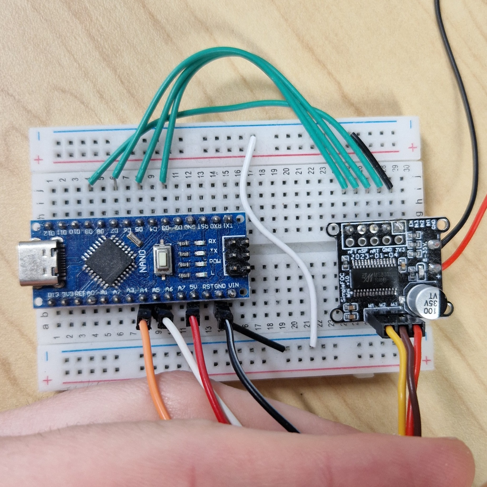

The robot 3D part has been made using Alibre however the final exported file are present on the `export`. If you need to modify original file you can contact original creator at : eymeric.chauchat@gmail.com

Concerning the hardware used :

- [10 50PCS/LOT Disc N52 Radial Magnetization NdFeB Magnet 3*3 4*3 5*3 Strong Rare Earth Permanent Neodymium Magnets 3x3 4x3 5x3](https://ja.aliexpress.com/item/1005010665988967.html?spm=a2g0o.productlist.main.1.51a740c5wlKSkE&algo_pvid=003ae441-8493-4d59-89ab-283d2b48806e&algo_exp_id=003ae441-8493-4d59-89ab-283d2b48806e-0&pdp_ext_f=%7B%22order%22%3A%22181%22%2C%22eval%22%3A%221%22%2C%22fromPage%22%3A%22search%22%7D&pdp_npi=6%40dis%21JPY%21845%21845%21%21%215.22%215.22%21%402101246417757071484513674edec8%2112000053126744883%21sea%21JP%212839209671%21X%211%210%21n_tag%3A-29919%3Bd%3Aaa7cf7ec%3Bm03_new_user%3A-29895&curPageLogUid=BP3TOUawie8E&utparam-url=scene%3Asearch%7Cquery_from%3A%7Cx_object_id%3A1005010665988967%7C_p_origin_prod%3A) *other size used because original not available to buy anymore*
- [1/2PCS AS5048A Magnetic Encoder PWM/SPI Interface High Precision 14 Bit Brushless Motor AS5048A Encoder SPI/I2C](https://ja.aliexpress.com/item/1005006939292362.html?spm=a2g0o.order_list.order_list_main.266.5d04180210IOS2&gatewayAdapt=glo2jpn)
- [Brushless Motor Driver Simple FOC Mini DC 8V-30V 2.5A FOC Control Driver SVPWM/SPWM Algorithm DRV8313 Chip Driver Board](https://ja.aliexpress.com/item/1005007181079288.html?spm=a2g0o.order_list.order_list_main.256.5d04180210IOS2&gatewayAdapt=glo2jpn)
- [Brushless Gimbal Motor **2208 80T**/ 2204 260KV / 2804 100KV / 2805 140KV / 2206 100T For CNC Digital Camera Mount FPV](https://ja.aliexpress.com/item/1005006008489660.html?spm=a2g0o.order_list.order_list_main.307.5d04180210IOS2&gatewayAdapt=glo2jpn) *2208 80T used*

You can use any DC voltage regulator up to 12V (check specification to run at higher voltage).

Concerning the tracking camera, you can use any direct sensor reading camera : 
- We used PS Eye
- Other probable camera :
  - Arducam (OV9281)
  - ELP (OV2710)
  - Any raspberry camera

Wiring is the following :

